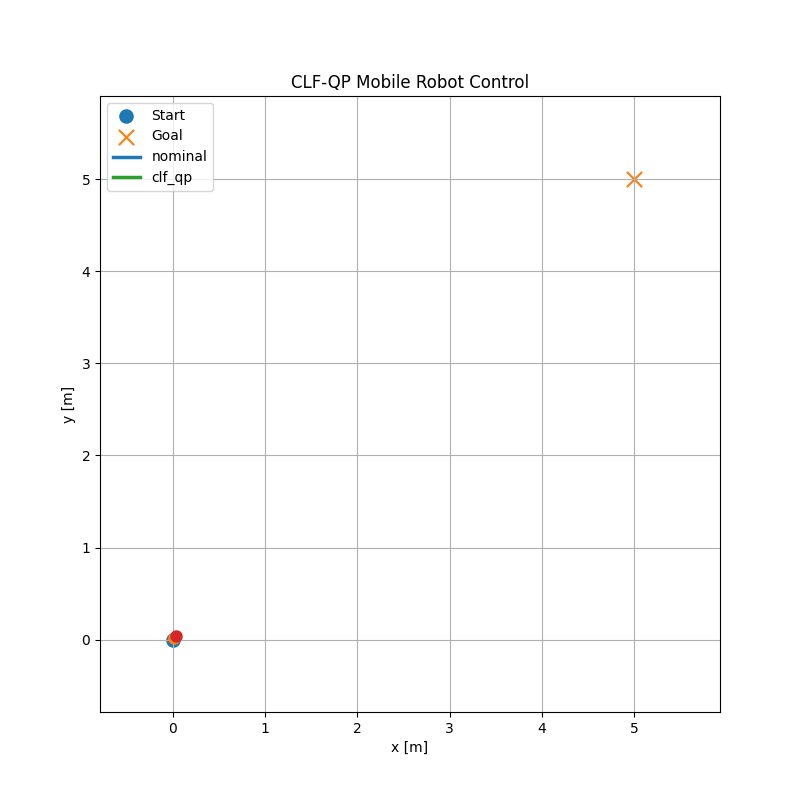

# Python CLF-QP Mobile Robot Control

<p align="center">
  
</p>


This project demonstrates Control Lyapunov Function Quadratic Programming (CLF-QP) control for a simple 2D mobile robot using Python.

The goal is to show how a Control Lyapunov Function can be used to guarantee convergence to a target point.

This project focuses on **stability and convergence**, not obstacle avoidance.

---

## 1. Project Idea

A mobile robot starts from an initial position and must reach a desired goal position.

The robot state is:

```text
p = [x, y]
```

The control input is:

```text
u = [ux, uy]
```

The robot dynamics are:

```text
p_dot = u
```

This means the control input directly determines the velocity of the robot.

---

## 2. Control Lyapunov Function

A Control Lyapunov Function is used to measure how far the robot is from the goal.

Define the tracking error:

```text
e = p - p_goal
```

The Lyapunov function is:

```text
V = 1/2 * e^T e
```

This is equivalent to:

```text
V = 1/2 * distance_to_goal^2
```

If the robot is far from the goal, `V` is large.

If the robot reaches the goal, `V = 0`.

---

## 3. CLF Stability Condition

To guarantee that the robot moves toward the goal, the Lyapunov function must decrease over time.

The CLF condition is:

```text
V_dot <= -cV
```

where `c > 0` is the convergence rate.

For the robot dynamics:

```text
p_dot = u
```

and:

```text
V = 1/2 * e^T e
```

we get:

```text
V_dot = e^T u
```

Therefore, the CLF constraint becomes:

```text
e^T u <= -cV
```

This constraint forces the control input to reduce the Lyapunov function.

---

## 4. CLF-QP Controller

The controller starts with a nominal control input:

```text
u_nom
```

However, the nominal controller is not guaranteed to satisfy the CLF condition.

The CLF-QP controller solves:

```text
minimize    ||u - u_nom||^2

subject to  e^T u <= -cV
```

This means:

```text
Choose a control input close to the nominal controller,
but enforce the Lyapunov stability condition.
```

In this project, the QP is solved in closed form by projecting the nominal control input onto the feasible CLF constraint set.

No external optimization solver is required.

---

## 5. Compared Controllers

This project compares two controllers.

### 1. Nominal Controller

The nominal controller moves toward the goal, but it is intentionally weak and includes a rotational component.

It may reduce the distance to the goal, but it does not guarantee convergence.

### 2. CLF-QP Controller

The CLF-QP controller modifies the nominal control only when needed to satisfy:

```text
V_dot + cV <= 0
```

This guarantees that the Lyapunov function decreases.

---

## 6. Simulation Results

Example results:

```text
Mode: nominal
Final distance to goal: 0.7459 m
Path length: 7.5877 m
Control energy: 4.6683
Control smoothness: 0.0132
Max CLF violation V_dot + cV: 12.50000000
Final Lyapunov V: 0.27985475

Mode: clf_qp
Final distance to goal: 0.0476 m
Path length: 8.9253 m
Control energy: 10.9966
Control smoothness: 0.2334
Max CLF violation V_dot + cV: 0.00000000
Final Lyapunov V: 0.00114369
```

The nominal controller does not reach the goal accurately and violates the CLF condition.

The CLF-QP controller reaches the goal and satisfies the CLF constraint.

---

## 7. What the Plots Show

The project generates the following plots:

```text
results/trajectory_comparison.png
results/distance_to_goal.png
results/lyapunov_function.png
results/clf_constraint.png
results/control_inputs.png
results/clf_correction.png
results/clf_mobile_robot_animation.gif
```

### Trajectory Comparison

Shows the robot path for the nominal controller and the CLF-QP controller.

### Distance to Goal

Shows how the distance to the goal changes over time.

### Lyapunov Function

Shows how the energy-like function `V` decreases.

### CLF Constraint

Shows whether the condition:

```text
V_dot + cV <= 0
```

is satisfied.

For the CLF-QP controller, this value should remain less than or equal to zero.

### Control Inputs

Shows the control commands applied to the robot.

### CLF Correction

Shows how much the CLF-QP controller modifies the nominal control input.

---

## 8. Project Structure

```text
python-clf-mobile-robot-control/
│
├── README.md
├── requirements.txt
├── main.py
│
├── src/
│   ├── clf_controller.py
│   ├── simulate.py
│   ├── metrics.py
│   └── plot_results.py
│
└── results/
    ├── trajectory_comparison.png
    ├── distance_to_goal.png
    ├── lyapunov_function.png
    ├── clf_constraint.png
    ├── control_inputs.png
    ├── clf_correction.png
    └── clf_mobile_robot_animation.gif
```

---

## 9. How to Run

Create a virtual environment:

```bash
python3 -m venv .venv
source .venv/bin/activate
```

Install dependencies:

```bash
pip install -r requirements.txt
```

Run the simulation:

```bash
python main.py
```

---

## 10. Requirements

* Python 3
* NumPy
* Matplotlib
* Pillow

---

## 11. Key Takeaway

CLF is used to guarantee convergence to a goal.

The main idea is:

```text
Define a Lyapunov function V.
Force V to decrease over time.
Use this condition as a constraint on the control input.
```

The CLF-QP controller chooses a control input close to the nominal controller while guaranteeing:

```text
V_dot <= -cV
```

This project shows that CLF-QP provides a stability guarantee that the nominal controller does not provide.

---

## Important Note

CLF is used for convergence and stability.

It does not handle obstacle avoidance.

Obstacle avoidance and safety constraints are handled using Control Barrier Functions (CBF).

---

## Author

Suleiman Diabat
